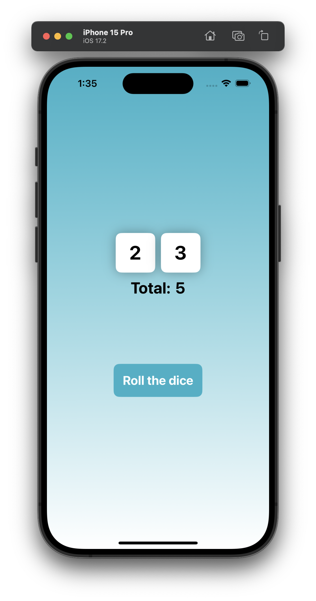

# DiceRoll

## Описание
**DiceRoll**- это приложение для бросания двух виртуальных игральных костей с эффектом постепенного изменения значений и тактильной обратной связью.

### 🎯 Суть приложения

В отличие от простых генераторов случайных чисел, **DiceRoll** создает динамичный процесс броска, где значения на кубиках меняются с визуальной и тактильной обратной связью:

- Приложение бросает два стандартных шестигранных кубика.

- Во время броска значения на кубиках меняются несколько раз.

- Каждое изменение значения сопровождается тактильным откликом (вибрацией).

- В конце броска отображаются финальные значения и их общая сумма.

### 🧠 Ключевые возможности

**Динамичный бросок:** Постепенная смена значений на обоих кубиках перед остановкой на финальных.

**Тактильная обратная связь:** Виброотклик при каждом изменении значения для усиления иммерсивности.

**Автоматический подсчет:** Мгновенный расчет суммы выпавших очков на двух кубиках.

**Простой интерфейс:** Четкое отображение двух кубиков и общей суммы без излишней сложности.

## Скриншот интерфейса приложения

