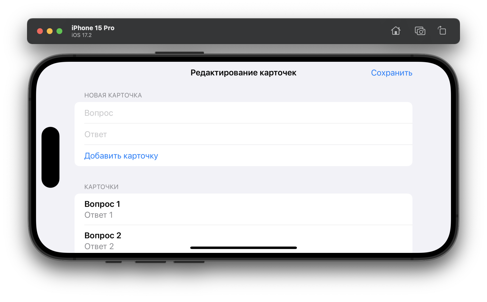
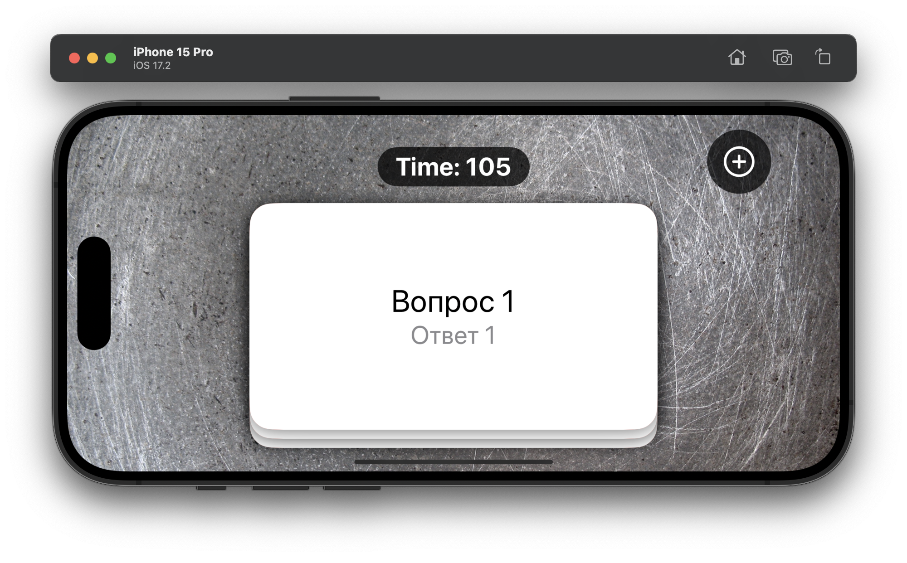
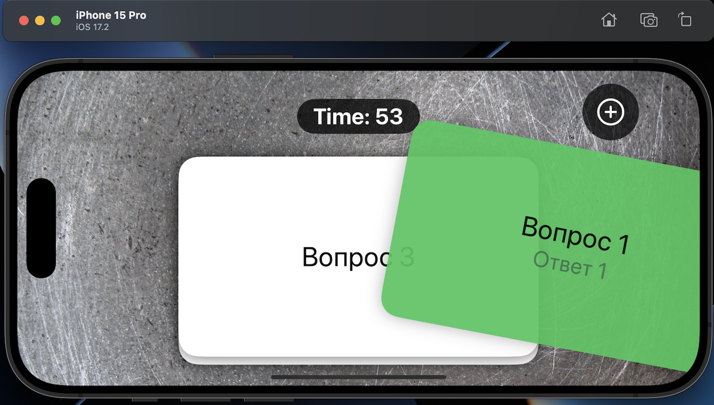
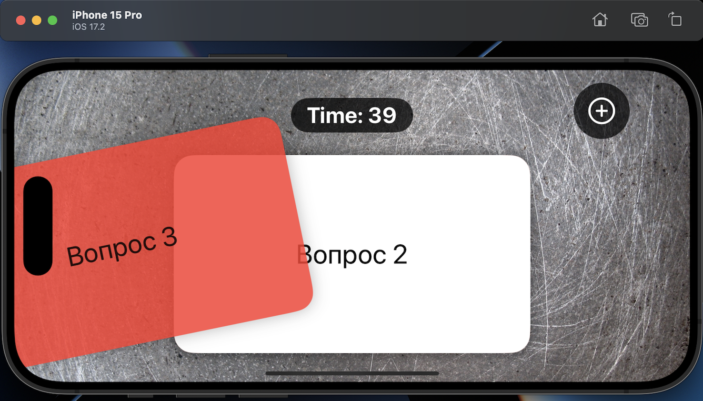

# Flashzilla

## Описание
**Flashzilla** — это интерактивное приложение для обучения с помощью цифровых карточек, которое использует современные технологии для эффективного запоминания.

### 🎯 Суть приложения

В отличие от статичных приложений для запоминания, **Flashzilla** предлагает иммерсивный опыт обучения с жестами и динамической обратной связью:

- Пользователь создает колоды карточек с вопросами на одной стороне и ответами на другой.

- Для навигации и взаимодействия с карточками используются интуитивные жесты (свайпы, тапы).

- Система отслеживает прогресс и помогает фокусироваться на сложном материале.

- Все данные надежно сохраняются в SwiftData для синхронизации между устройствами.

### 🧠 Ключевые возможности

**Создание карточек:** Формирование персонализированных колод для изучения любой темы.

**Интерактивное обучение:** Использование жестов для переворота карточек и ответов (свайп вправо — знаю, влево — повторить).

**Отслеживание прогресса:** Визуальная обратная связь и таймеры для контроля времени обучения.

**Адаптивное повторение:** Карточки, вызвавшие затруднения, возвращаются в колоду для повторного изучения.

**Надежное хранение:** Сохранение всех колод и прогресса в базе данных SwiftData.

## Скриншоты интерфейса приложения

