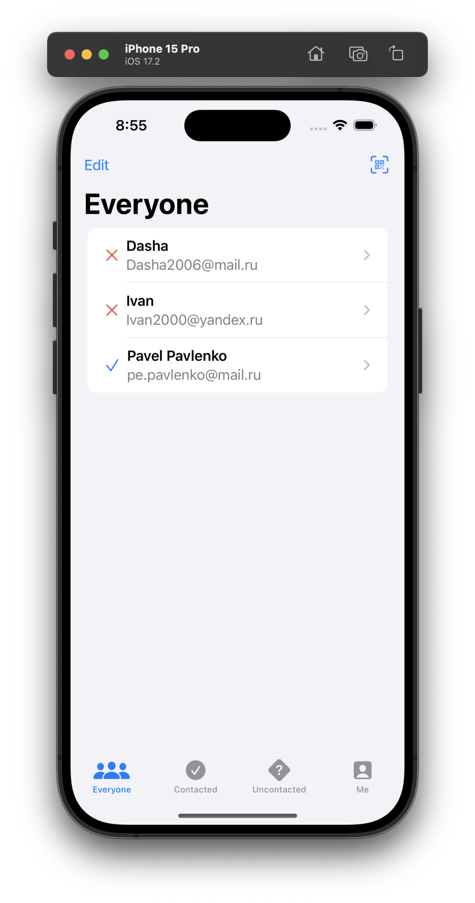
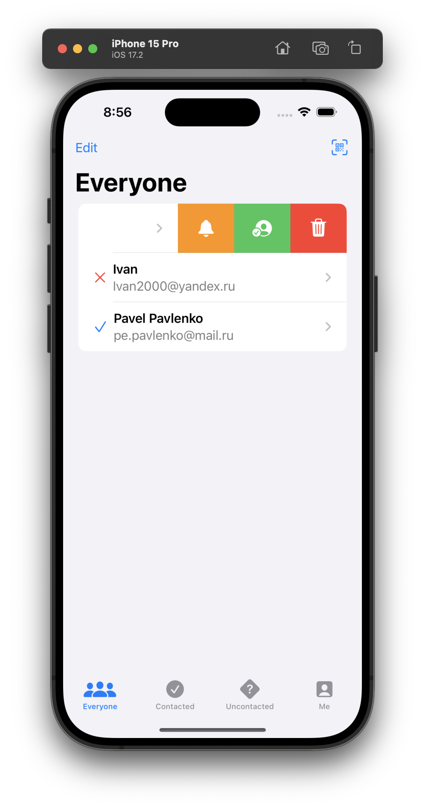
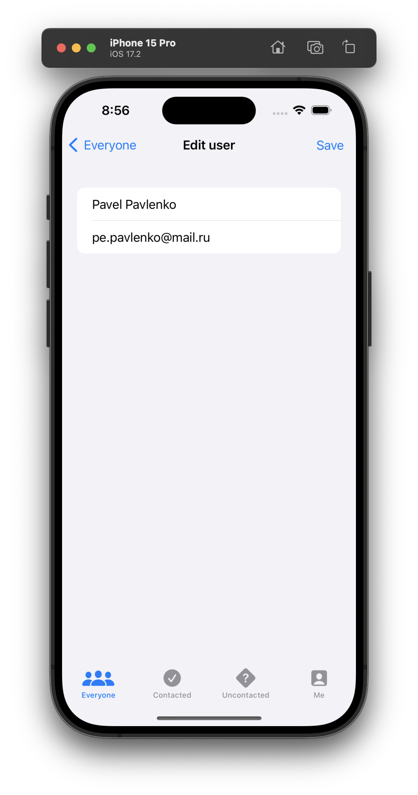
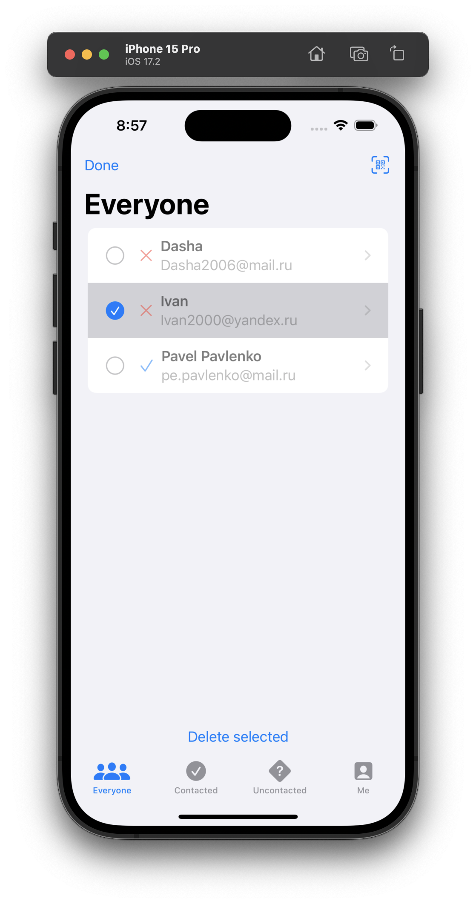
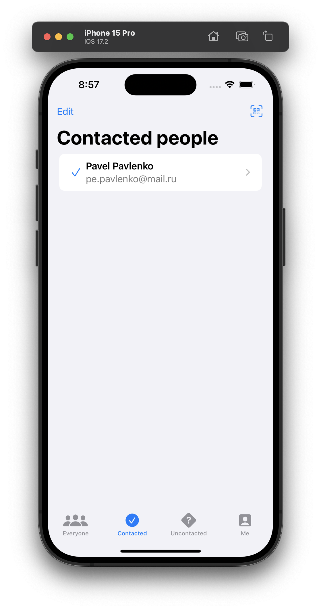
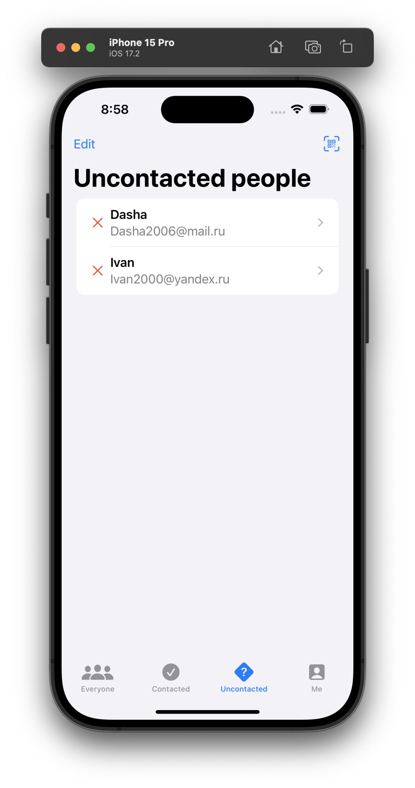
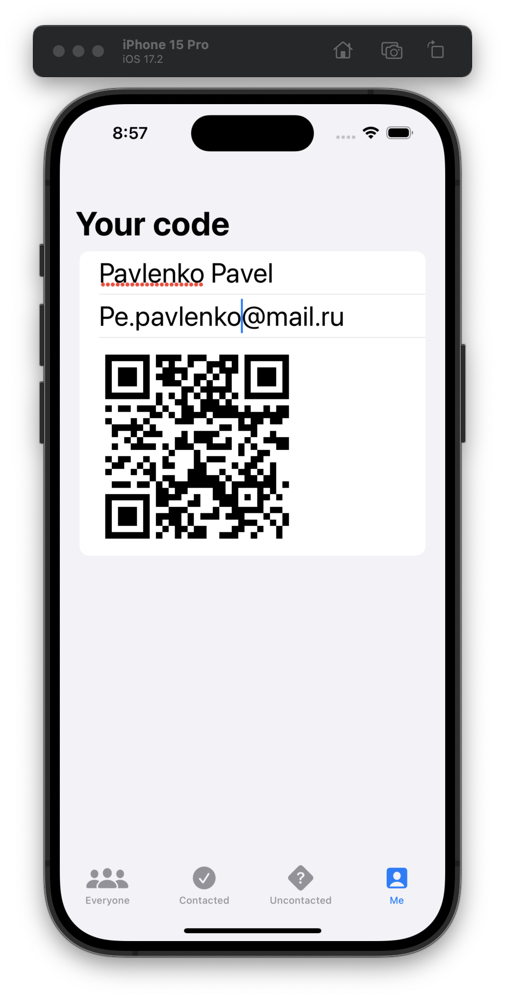

# HotProspects

## Описание

**HotProspects** — это профессиональное приложение для нетворкинга на конференциях с обменом контактами через QR-коды.

### 🎯 Суть приложения

В отличие от простых списков контактов, **HotProspects** предлагает современный способ цифрового нетворкинга:

- Приложение генерирует персональный QR-код с вашей контактной информацией.

- Вы можете сканировать QR-коды других участников, чтобы мгновенно добавлять их в свой список контактов.

- Интеллектуальная система сортировки автоматически распределяет контакты по категориям.

- Настроенные уведомления помогут не забыть о важных знакомствах.

### 🧠 Ключевые возможности

**Цифровая визитка:**
Создание персонального QR-кода с вашими данными для быстрого обмена.

**Сканер контактов:**
Мгновенное добавление людей в список путем сканирования их QR-кодов.

**Умная сортировка:**
Категоризация контактов с помощью контекстных меню

**Напоминания:**
Настройка локальных уведомлений для последующего взаимодействия с важными контактами.

**Гибкий интерфейс:**
Использование панелей вкладок (TabView) для удобной навигации по разделам приложения.

## Скриншоты интерфейса приложения

<table>
  <tr>
    <td></td>
    <td></td>
    <td></td>
  </tr>
  <tr>
    <td></td>
    <td></td>
    <td></td>
  </tr>
  <tr>
    <td></td>
  </tr>
</table>
